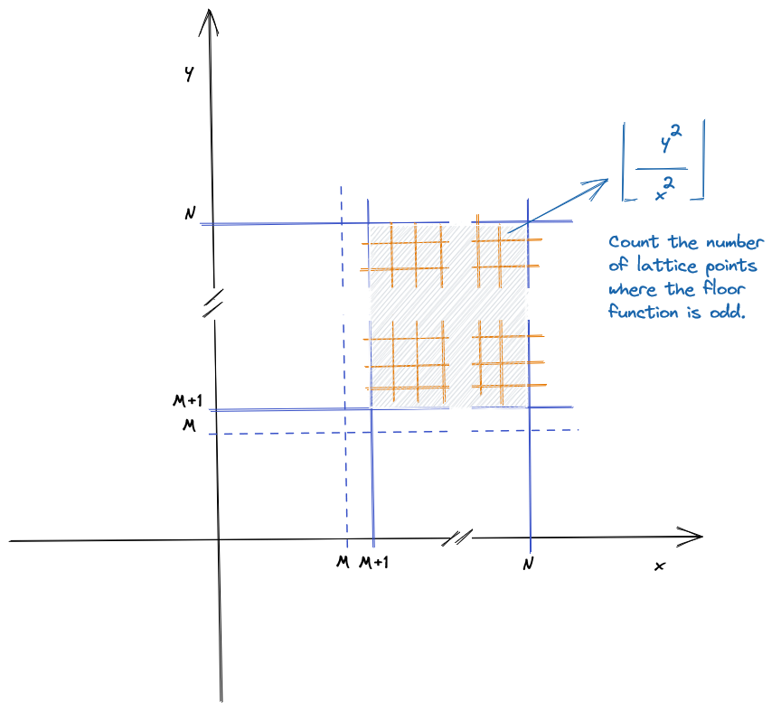

# TDD solution of Pencils of Rays (from Project Euler)

[](https://opensource.org/licenses/MIT)

The intension of this program is to show how to do [TDD](https://en.wikipedia.org/wiki/Test-driven_development) (Test-Driven Development). 
The solution will be very naive and simple. No optimizations or complex 
algorithms will be used. 

A Project Euler problem is used just not to have the need to invent a problem
to illustrate TDD.

## Pencils of rays (problem 372)

Let $R(M,N)$ be the number of lattice points $(x,y)$ which satisfy $M<x \le N, M<y \le N$, 
and $\lfloor\frac{y^2}{x^2}\rfloor$ is odd.

We can verify that $R(0,100)=3019$ and $R(100,10000)=29750422$.

Find $R(2 \cdot 10^6,10^9)$.



*Note*: $\lfloor x \rfloor$ represents the floor function.

## Project Euler

[Project Euler](https://projecteuler.net) is a series of challenging mathematical/
computer programming problems that will require more than just mathematical 
insights to solve. Although mathematics will help you arrive at elegant and 
efficient methods, the use of a computer and programming skills will be required 
to solve most problems.

The motivation for starting Project Euler, and its continuation, is to provide a 
platform for the inquiring mind to delve into unfamiliar areas and learn new 
concepts in a fun and recreational context.

## Run the tests

The unit tests are developed using the unittest framework. Please install 
[unittest2](https://pypi.org/project/unittest2/). To run the unit tests use the 
command:

```
python 3 -m unittest tests/test_main.py
```
## Authors
*   [Ricardo Miranda](https://github.com/ricardomiranda)

## License
This project is licensed under the MIT License - see the [LICENSE](LICENSE) file for details
